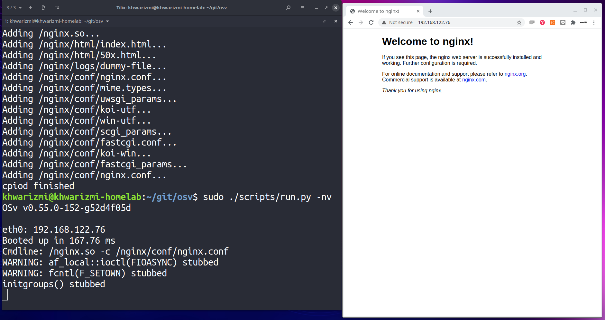

========================
Unikernelを試してみる
========================

こんにちは．@khwarizmi6514 です．
この記事は `法政大学応用情報 Advent Calender 2020 <https://adventar.org/calendars/5671>`_ の23日目の記事です．

本来はこういった人目につくような行動は好かないのですが，学生最後の年と言うことで思い出にと思い，名を連ねてみました．
あまりにも家から出なくて日付感覚がなく，気付いたら担当日になってしまっていたので頑張って書きます．

話は題の通りUnikernelについてです．
※この記事は読みやすさのため，または筆者の主観を含むため，正確ではない情報を含みます．

Unikernelの概要
=================

Unikernelを恐れずに一言で言うと，
「あるアプリケーション実行のための小さなkernel」
です．

kernelは汎用性のため，多くの機能を持ちますが，ある一つのアプリケーションの実行を考えたとき，機能の全てが必要になるようなものはないでしょう．
そこで使わない機能を除いた小さなkernelをアプリケーションに紐づけてアプリケーションを動かすようにします．
unikernelの主な長所として4つ書かれています．(http://unikernel.org/)
- Improved security
- Small footprint
- Highly optimized
- Fast boot

様々な実装が存在し，特徴も異なります．
詳しい情報は，リンク先に任せることとして．．．

試してみる話が本題なので，早速試していきたいと思います．

試してみる
============

OSv で minecraft server を構築，，したかった，，
--------------------------------------------------

OSv(http://osv.io/) はUnikernelの実装の中でも有名なものの一つで，既存のUnixアプリケーションの実行のために設計され，様々な環境に対応したUnikernelです．
これを利用してminecraft server が構築できることが知られているので，これを行いたかったのですが，
うまく実行することができませんでした．
間に合いそうにないので，ひとまず記事を書き上げるために別の目標を設定することにします．
後日取り組んで成果が出た場合，ここに追記することにします．
minecraftは身近で有名ですから，これが達成できたら良い話題になるなと思ったのですが，申し訳ありません．

nginxでhttpサーバを建てる
---------------------------

と言うわけで目標は題の通りになりました．
デフォルトページを表示して満足するだけですが，↑に時間を取られてしまい，時間がありませんでした．．．

OSvは様々なハイパーバイザの上で実行できることが知られていますが，ここではKVMを対象にしています．
KVM環境が構築されていることを前提とします．
また，実験はubuntu2004(kernel ver:  )で行っています．

osvのリポジトリをcloneしてきます．

::

 $ git clone https://github.com/cloudius-systems/osv.git & cd $_

サブモジュールとして，musl(syscallの実装)とサンプルアプリケーションがあるのでそれを持ってきます．

::

  $ git submodule update --init --recursive

Unikernelやイメージの構築のためのパッケージ類等をインストールします．

::

  $ sudo ./scripts/setup.py 

ここで，後々のために一つパッケージをインストールします．
(実行時にネットワーク設定のためifconfigが必要です)

::

  $ sudo apt install net-tools

サンプルアプリケーションをビルドします．

::
  
  $ sudo ./scripts/build image=nginx

実行します．ちなみに実行は一番最近ビルドされたイメージを対象として行うため特別指定は必要ありません．
なお，デフォルトで4vCPU・メモリ2Gです．
ちなみに，デフォルトでKVMのdefaultネットワークに接続がされるようです．

::

  $ sudo ./scripts/run.py -nv

ここまでできると画像のようになります．
画像をみるとわかりますが，とにかく爆速で起動していることがわかります．

せっかくなのでベンチマークをとってみたけど．．
==================================================

せっかくなのでベンチマークを簡単にとってみました．
OSvについては↑と同じように実行しました．
比較対象として，KVM上に通常のVMを立て，そこにデフォルトのnginxサーバを構築し，ベンチマークを取りました．
OSvと同じ4vCPU・メモリ2Gです．
ベンチマークはapache bench(ab)を利用し，リクエスト数は200に固定しました．
同時接続数は20, 50, 100の3通りについて計測しました．
結果は↓の通りです．
ちなみに，なんでこんなにしょぼい負荷なのかは結果の後に述べます．

.. csv-table::
  :header: 同時接続数, OSv, 通常のVM
  :widths: 3, 3, 3

  20, 0.039s, 0.011s
  50, 0.016s, 0.004s
  100, 0.007s, 0.009s

OSvの方がパフォーマンスがよくなるような結果を期待しましたが，そのような計測結果は得られませんでした．
と言うか，そもそもこのレベルの負荷だとあまり比較する価値がないですね．．，
実はOSvですが，これ以上リクエスト数や同時接続数を増やしたりすると，止まってしまったり早い段階でfailed requestが目につくようになってしまうのです，
と言うわけでこのくらいの負荷レベルしか採用することができませんでした．
僕の知識は未熟なので，設定等に至らない部分があった可能性は十分にあります．

まとめ
========

以上のようにすることで，Unikernelを試してみることができます．
思うようなベンチマーク結果は得られませんでしたが，上記手順を試してみてくださった方は起動の速さはきっと体感していただけたかと思います．
Unikernelはまだ新興な技術なので，今回の記事で知ってくださる方がいらっしゃれば嬉しいなと思います．
何かコメントがございましたら，Twitter(@khwarizmi6514)までお願い致します．

参考
======

- https://qiita.com/t-imada/items/ed6a76f5b257f5608ad0 広くまとまった日本語記事
- http://unikernel.org/ unikernel org
- http://osv.io/ OSv 
- https://github.com/cloudius-systems/osv OSv git repo

