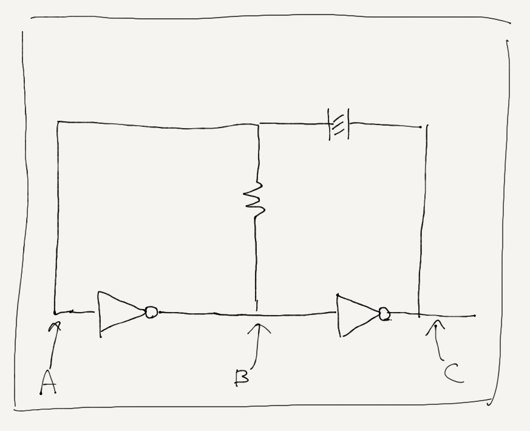
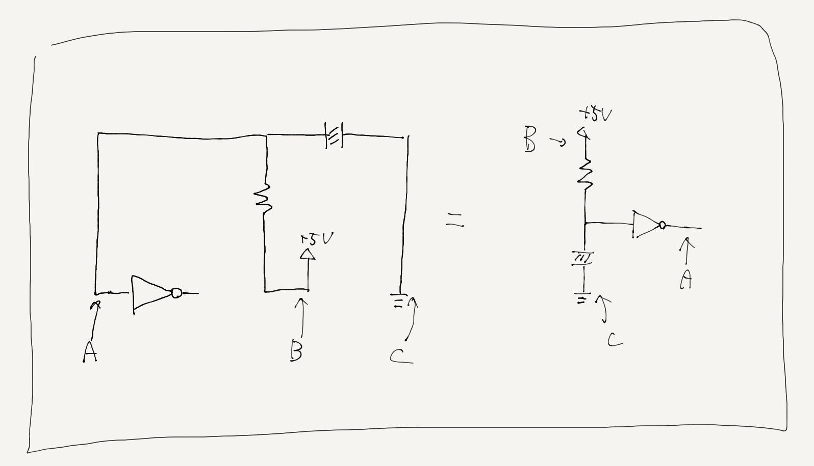
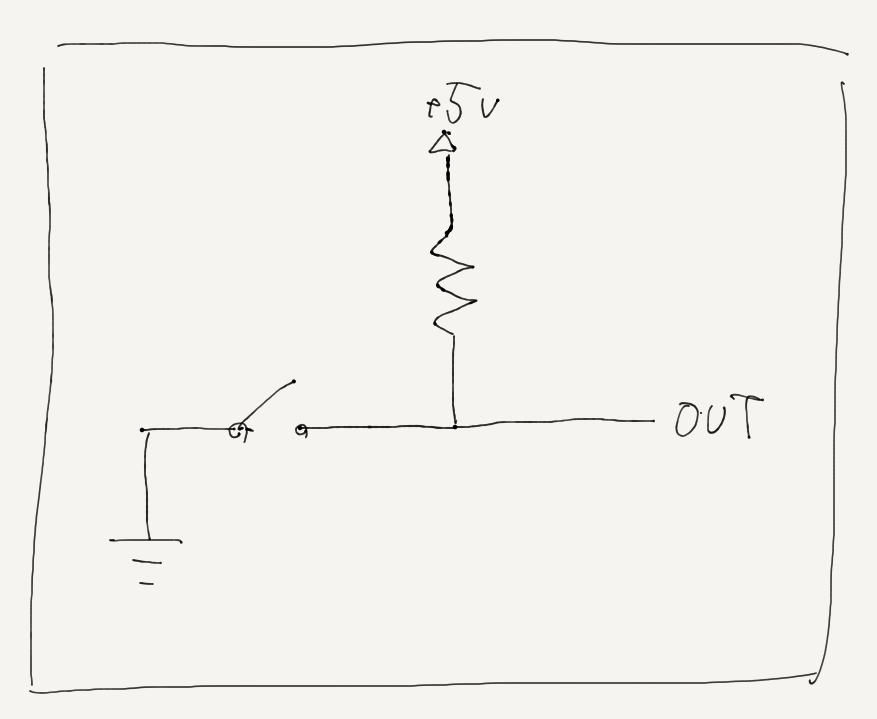

==============
CPU関連のメモ
==============

そもそもCPUってなんなのって話
==============================

昔適当にIC並べて全加算器作ったりとかあったけど，これにレジスタついたりしたらもうCPUだよねって人と話たりしたんだけど，それだけだと正直よくわからんよね．
だって僕の知ってるCPUってプログラム読み込んだりするし，なんかidleしたりするし，計算のために人間のいろんな助け必要としないし，
そう考えるとCPUってなんなのかが本当にわからなくなる．
じゃあCPUってなんなのか．

**CPUとは**

- 命令fetch:  プログラムカウンタ(レジスタ?)を見て命令(プログラム)をメモリから読む
- デコード:   命令を解読?
- 演算:       命令を実行
- ストア:     結果をメモリに格納

以上の動作をクロックに合わせて繰り返す．

これがCPU．
逆にいうとこれだけ満たしていればCPU．

クロックジェネレータ(発振回路)
================================

CPUの動作の同期を取っているもの．
あんま詳しくない人でもCPU選ぶときにクロック周波数とかあるから知ってるやつ．
電気的には，ある一定周期でHとLを行ったり来たりする回路．
これの立ち上がりとか立ち下がり?に合わせてCPUは動作することになる．もちろんどちらかは設計による．
実際には水晶発振子とかが使われるらしいよ．

回路は↓のようになる．

これだけ見るとなんだこれって感じなんだけど，ある一点の電位から考えると綺麗に発振するのがわかるからしゅごい．
(これ，出力Aの隣のNOTのところが出力なんだけど書き忘れたから気が向いたら描き直すかも)

点AがLだったとすると，点BはHで点CはLになる
すると回路は↓のように読み替えられる．

(この図Aの位置が右にずれてるから気が向いたらなおそ.)

この状態だと，BからCに電流が流れるのでコンデンサに電荷が溜まって行き，電圧がしきい値まで上がると点AがHと認識されるようになる．
AがHだと，(最初の図に戻って見るとわかりやすいけど)BがL，CがHになる．
すると今度は回路が↓のように読み替えられる．

ROMとかRAMとかメモリ系の話
===========================

メモリとはなんなのか．
0,1を記憶・保持しておく素子．(素子ってなんか違う気がするけどとりあえずこのままでいいや)
そんなのはわかっている．
記憶ってなんだよ．保持ってなんだよ．
フリップフロップだけ見せてドヤ顔してくる人いるけどそんなのもちろんわかってて，
さらに揮発性がどうだのとか言われるとよりわからなくなる．

さて，端的に僕の結論を述べると，
メモリとは「スイッチ」である．

1bitのメモリを考える．
これは当然，1つの0,1を記憶・保持しておくものなんだけど，
電気的に考えるともっとわかりやすくて，
その素子の出力の0,1を素子の状態でコントロールできるやつ．
みたいなイメージ．
↑よくわからないと思うんだけど，実際にスイッチを1bitメモリにしたのを見ればマジで早いから見ればいいんだ．

これ，スイッチをONにすると接地されて電気的にLowに，そしてOFFにするとHighになるわけだ．
要は1つの0,1を記憶・保持できているわけだ．
メモリに書き込む行為はスイッチのON, OFFを切り替える行為と同じであるわけだが，
ここまでくると今度は書き込み(スイッチの切り替え)とかいう概念がわからなくなるかもしれない．
そりゃそうだ僕もPCのメモリを書き換えるためにスイッチぽちぽちしたことなんてない．
では実際メモリの書き込みってどうなってるのか，昔のメモリの話をする．
昔のメモリはさっきいったスイッチのところに「ヒューズ」というものを使っていたらしい．
これは，「電流を大量に流すと断線するただの導線」見たいなものらしく，本来保護回路に使われるものらしい．
つまり，メモリへの書き込みを「大量に電流を流して導線を切る」ことに置き換えている．
もちろん導線を戻すことはできないのでこれは一度書き込みしたら変えられない，すなわちROMである．
これ書き込みを再度できるようにするにはどうするかっていうとなんか「フローティングゲート」っていうのとかあるらしいぞ．
これRAMじゃなくてEPROMの話だけど，RAMもそういう感じなんじゃないのって思ってる．
よくわかんないけどそういうのは電気の人に任せてもいい領域だと僕は判断した．
磁気系の記憶素子も僕の理解すべき範疇ではないと判断した．

