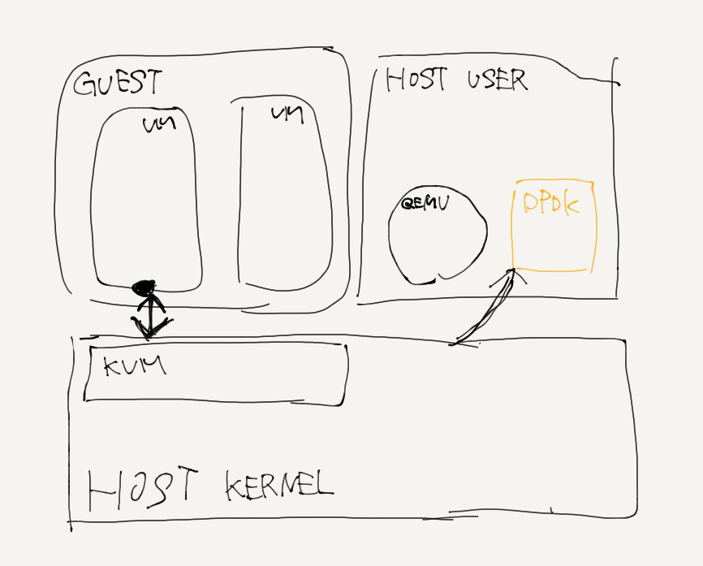
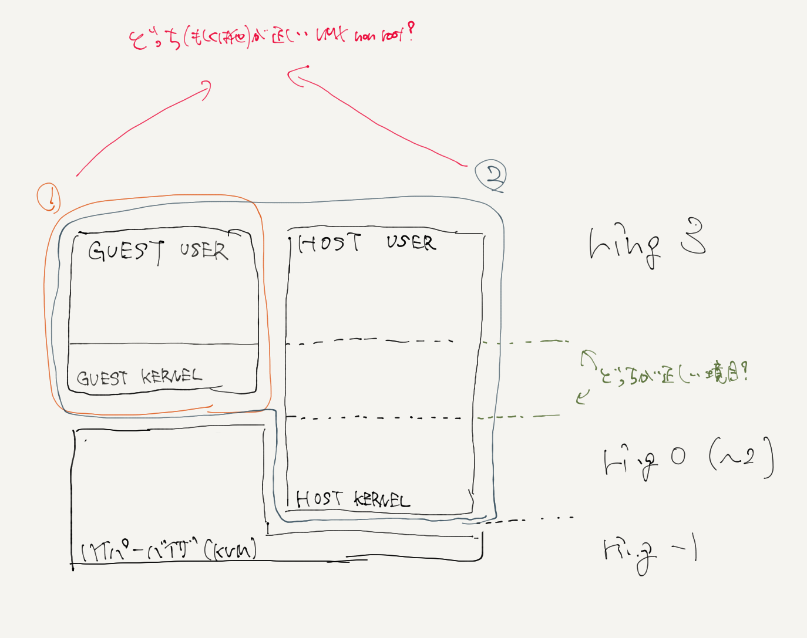
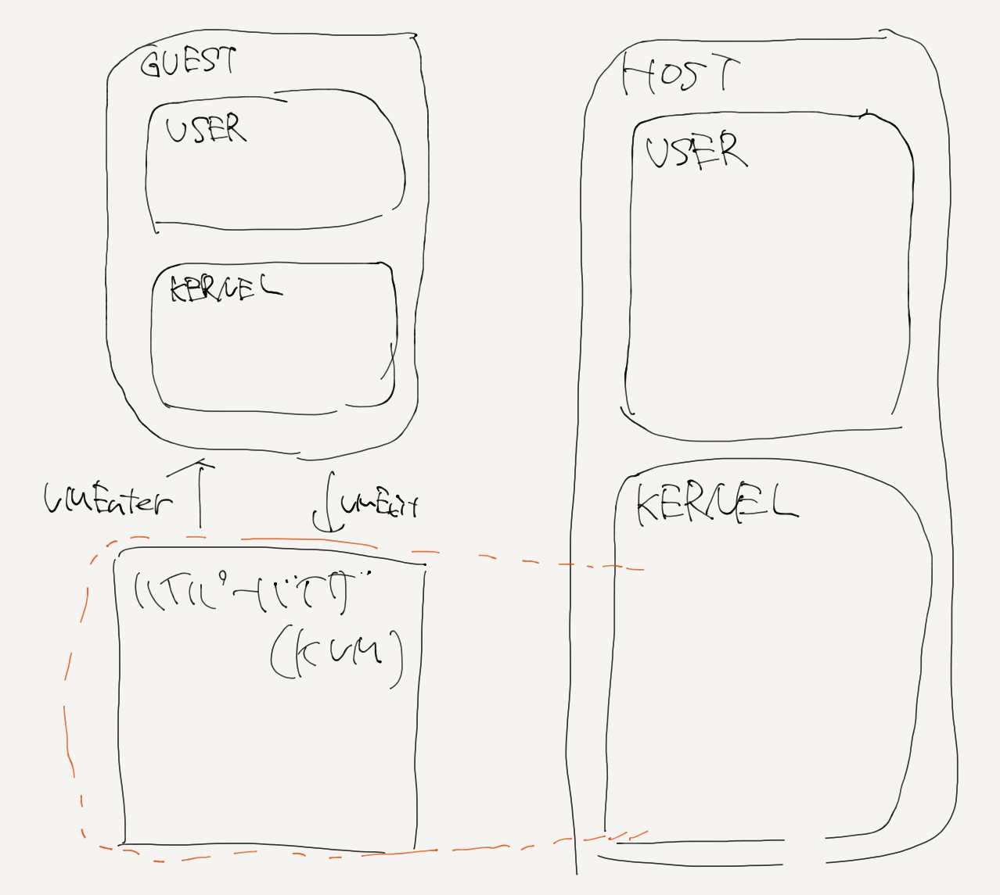

==================================
ハイパーバイザ仮想化に関する内容
==================================

※ここでの話は基本的にKVM/QEMUの話が前提．そうでない場合は注釈をつける．※

仮想化の問題点
=================

現代のマシンの3大コンポーネントは CPU・メモリ・(データ/デバイス)IO の3つである．
仮想マシンを動かすということは，上記の3つをなんらかの方法により動いているように見せるというものである．
IOはハードウェアエミュレータで取り合えず仮想化ができそうだ．
メモリはCPUがどうにかなればCPUの保護機能でどうにかしてくれそうだし，そうでなくてもOSが持ってるメモリプロテクション機能とかあるし
なんかよろしくやってくれそうな感じがする．
となるとCPUである．
とりあえず動作すればいいだけならハードウェアエミュレータでCPUをエミュレートすれば良いのでなんだかこれも達成できそうであるが，
ここでCPUをエミュレートすることをもうちょっと掘り下げて考える．
仮想マシンのinstructionはあるユーザランドのエミュレータで実行されようとする．
それはエミュレータによってユーザランドのプロセスとして処理される．
それはカーネル空間に入って処理がなされる．
CPUに~~~~~~
こう考えると，仮想マシン上ではたった一つのinstructionが，実プロセッサではどれだけ大量のinstructionnに増えていることだろう．
コンテキストスイッチもあるしリングプロテクションの遷移もあるし，
本当に実行したいinstructionを実行するのにどれだけの余剰のinstructionが生まれるのだろう．
こういうわけでパフォーマンスの問題が大きくのしかかることになる．
完全仮想化には大きなパフォーマンスの犠牲が伴うのである．
じゃあ至極単純に仮想マシンのinstructionも実プロセッサに丸投げしようと思うとまた違う問題が発生する．
基本的にOSはリングプロテクションのring0で実行されることになっている．
これは，実ハードの全てのリソースに対して操作権限を持っているということである．
これでは，ホストOSや他のゲストOSに対して変更を加えてしまうようなことが起こりえない．
よってこの方法はダメ．

ではこの問題をどうやって解決するか．
一つの回答が準仮想化である．
さらにもう一つの回答がCPUの仮想化支援である．
それについて説明する．

Xenの準仮想化について
-----------------------

Xenの仮想化手法について説明する．
Xenは準仮想化，すなわち，ゲストOSに一部改変を加えることによって仮想化を実現している．
具体的には，OSが実行されるリングプロテクションの権限を変更することである．
例えば通常のLinuxでは，カーネル(OS)空間はring0，ユーザ空間はring3で実行されている．
これをカーネル空間はring1で実行されるように変更を行う．
この時もちろんハイパーバイザであるXenはring0である．
これにより他に影響を与えることを防ぐことができる．
ただしこれはOSに変更を加える必要がある．

CPUの仮想化支援
-----------------


ハイパーバイザに関して
======================

そのうちハイパーバイザに関するVMin/exitとかnonrootとかintel-VTとかそこらへんのことを書くけど今は書いてない

ちなみに，VMCSはVMの数だけ用意されるとshuu先生の資料にあったが，あれはおそらく間違いで，vcpuの数だけ存在するはずだ．


intel-VTはVMX-rootモードとVMX-non-rootモードを追加するもの．それはそうなのだが，どうやら別の見方があるようだ．
一部の見解では，「リングプロテクションにring0よりも上の特権階層を加えるもの」という見解があるらしい．
これは非常に大きなポイントである．
今までは，



だと思ってたのが実は



というような風になっている可能性があるということである．
つまりどういうことかというと，ハイパーバイザとホストカーネル空間は今まで同じ位置だと思ってた
(なんならハイパーバイザはホストカーネルサブセットだと思ってた)
のが，ハイパーバイザが一番高い特権レベルに存在することになるということである．
また，これってリングプロテクションとVMX-root, non-rootは並列に存在するものなのか同じ概念を別に表記してるだけなのにこんがらがってるのか
そういうのがよくわからん．
でも普通に考えてHOSTはVMX-rootであるような気がするから上の図は違う気がするんだけど，
いやていうかこの緑の下の図のリングプロテクションの番号だとゲストOSに変更加わっちゃうからこれは絶対に違う．

とりあえずshuu先生の

.. figure:: shuu-vt.png
  :scale: 40%
  :align: center

には途轍もない違和感を感じるようになってしまった．

色々考えた結果，



とすると，OSにプロテクションの番号の変更もなくなんとなくいい感じになってる気もするんだ．
もっと調査が必要だ．


準仮想化(paravirtualization)とvirtioに関して
=================================================

すでに述べた(ことになっている)通り，通常の仮想化の際はハードウェアに対するIOは全てハードウェアのシミュレーションが行われる．
これにより，従来のドライバをそのまま使用することができるため，可用性?を担保できる．このような物を完全仮想化とかいう．
ところでこのハードウェアをエミュレートする方式は，ハードウェア操作のたびにVMexitが発生してしまうため，効率的ではない．
そこで，エミュレーションによる性能低下を図るものが準仮想化(paravirtualization)であり，
その(Linuxでの)フレームワークがvirtioである．

完全仮想化が遅い理由
---------------------

ハードウェア操作はその主たる部分がレジスタ操作である．仮想環境でもそれは同じであり，ハードウェア操作の際には
数回のレジスタ操作が行われる．
また，ハードウェアをエミュレーションするとは，ハードウェアの持つべきレジスタ群を持ちそれらの動作に関する定義を持つことである．
ところで，ハードウェアのエミュレーションはQEMUによって行われる．QEMUはホストOS上の(ユーザ)プロセスである．
ホストOSがハードウェア操作を行う場合，ホストのメモリ空間にアクセスすることになるため，
VMexitしてハイパーバイザにハードウェアレジスタアクセスをエミュレートしてもらう必要があり，
エミュレートが終わるとVMenterされ動作がゲストOSに帰ってくる．
この一連の動作は仮想環境でのみ起こる操作であるため，実ハードウェアとの性能差が出ます．

(以下，一般的なハイパーバイザ環境でのIO性能低下についての引用)

VMX non-root mode・VMX root mode間のモード遷移にかかるコスト
````````````````````````````````````````````````````````````

ハードウェアレジスタアクセス時のVMExitとゲスト再開時のVMEntryでは，
それぞれVMX non-root modeとVMX root modeの間でモード遷移が発生します．
この遷移のコストはCPUの進化に伴い小さくなってきているものの，VMExit・VMEntryにそれぞれ1000サイクルほど消費します．

デバイスエミュレーションの呼び出しにかかるコスト
`````````````````````````````````````````````````

多くの場合，ハイパーバイザのデバイスエミュレータはユーザプロセス上で動作しています．
このため，ハードウェアレジスタアクセスをエミュレートするにはカーネルモードからユーザモードへ遷移し，
エミュレーションを行ってからカーネルモード へ戻ってくる必要があります．

また，ユーザプロセスはプロセススケジューラが適切と判断したタイミングで実行されるため，
VMExit直後にデバイスエミュレータのプロセスが実行される保証はありません．

同様に，ゲスト再開のVMEntryについてもデバイスエミュレーション終了直後に行われる保証はなく，
スケジューリング待ちになる可能性もあります．

また，たいていの完全仮想化デバイスでは一度のI/Oに複数回レジスタアクセスを行う必要があります
(たとえば，あるNICの受信処理では5〜6回のレジスタアクセスが必要になります)．
レジスタアクセスを行うたびに，上述の処理が発生し，大きなコストがかかります．
高速なI/Oが求められるデバイスの場合には，ここが性能上のボトルネックになります．

(以上，ハイパーバイザの作り方～ちゃんと理解する仮想化技術～ 第１１回 virtioによる準仮想化デバイス 
その１「virtioの概要とVirtio PCI」より引用)

virtioの概要
==============

virtio_pciっていうのがなんかPCIデバイスをエミュレートしてる見たいな立ち回りをする感じ．
実際のデータやりとりはvirtio ringっていうメモリ領域でやる．これはshared memory空間にいて，
完全仮想化の場合はデータのやりとり(つまりレジスタ操作)の際に必ず逐一VMExitを発生させる必要があったけど，
共有メモリだからそれがないはず．
virtqueueはvirtioのキュー構造体．


vhostとは
==========

この文章はかなりの不確実な成分を含んでいるのであとで必ず書き直す．
virtioと並んでvhostという準仮想ドライバがある．
virtioはバックエンドにQEMUを用いるが，vhostはカーネル空間にバックエンドが存在する．
そのため，コンテキストスイッチが少ない．
とりあえず今の所QEMUを使わないvirtioという風に認識している．
でこれのネットワークインタフェース実装がvhost-net
たぶん，vhostはゲストから見るとvirtioとはなんら違いがないんじゃないか．
ゲストから見たらvirtioって見えてそう．多分virtio_pciが見えてるだろうし．


vhostは、ゲストネットワークトラフィックをカーネル側から直接TUNデバイスに直接渡すことにより、上記のプロセスを加速できます。 このモデルでは、QEMUはvirtqueueの直接制御をカーネルドライバーに渡します。
とかって書いてある資料あったけど，これだとQEMUのパスは一応通ってそうなんだけどどうなのこれ．
QEMUのパス通ってるんだったらコンテキスト一応切り替わるからダメな気がするんだけど．

vhost-user
===========

上のvhostのDPDKアプライアンスのための実装としてvhost-userなるものがあるらしい．
カーネル空間を飛ばすみたいな記述もあったんだけどこれってどっちのカーネル空間の事言ってるんですか

vhost-user server と client
------------------------------

DPDK v16.07でvHostユーザークライアントモードが導入され、DPDKの制限に対処しました。これにより、vHostユーザーバックエンド（DPDKを備えたOVSなどのDPDKベースのアプリケーション）がクラッシュまたは再起動した場合、DPDK vHostユーザーポートを備えたVM バックエンドとの接続を確立し、基本的にネットワークの観点からは役に立たないようにします。 vHostユーザークライアントモードはこの問題を解決します。
とりあえずclient使っとけばいいよみたいな感じ．
要は，DPDKアプライアンスがvhost-userの主体?になる(clientはQEMUらしい)とそれがクラッシュした時に再現が大変になるから
serverは別にいてDPDKアプライアンスはclientとしてそれ(serverはQEMU)を利用するような形態にしたということ．

memo
=========

- virtioのゲスト側の実装はVMM側の実装とは別れている．
  ゲストマシンはvirtioのドライバを持っていてかつVMM側でvirtioのバックエンドドライバが動いている必要がある．
- 昔していた誤解
  virtioは準仮想「ネットワークインタフェース」のことだと思っていたが，そうではなく「準仮想ドライバのフレームワーク」．
  それはネットワークインタフェース実装はvirtio-net
