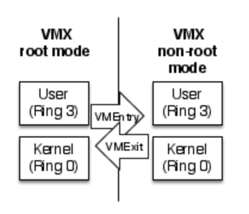
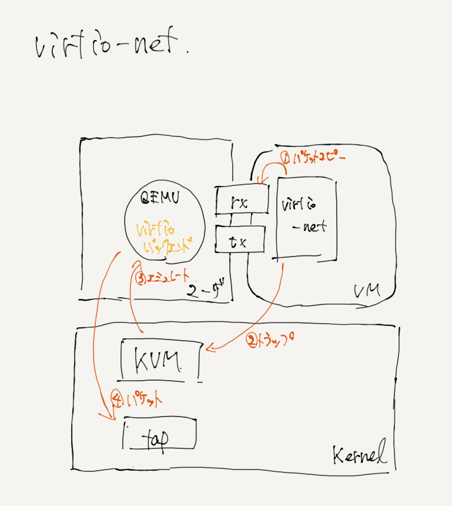
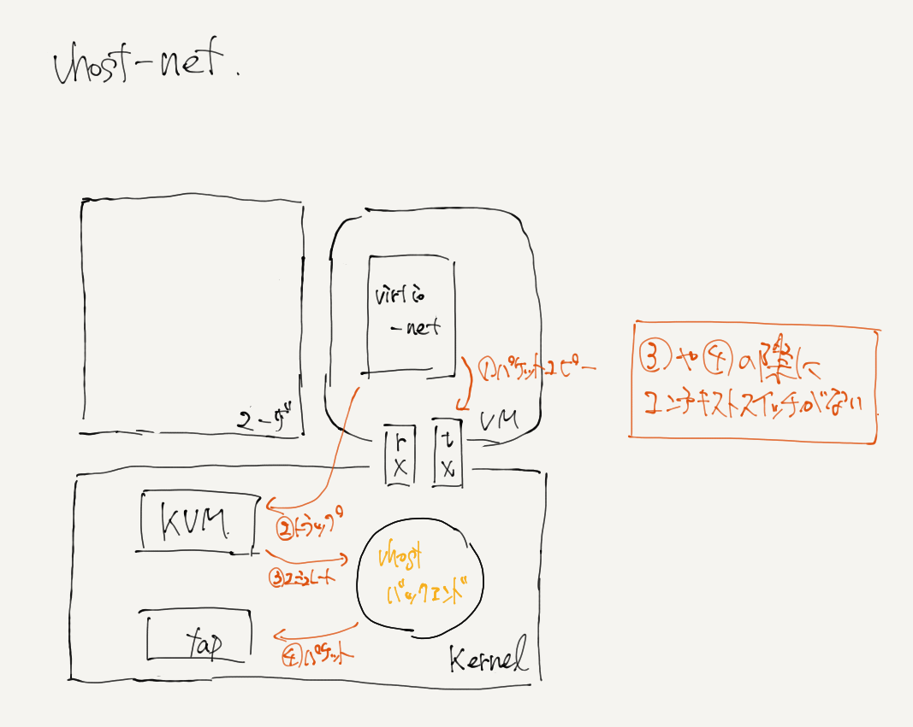

==================================
ハイパーバイザ仮想化に関する内容
==================================

※ここでの話は基本的にKVM/QEMUの話が前提．そうでない場合は注釈をつける．※

仮想化の問題点
=================

現代のマシンの3大コンポーネントは CPU・メモリ・(データ/デバイス)IO の3つである．
仮想マシンを動かすということは，上記の3つをなんらかの方法により動いているように見せるというものである．
IOはハードウェアエミュレータで取り合えず仮想化ができそうだ．
メモリはCPUがどうにかなればCPUの保護機能でどうにかしてくれそうだし，そうでなくてもOSが持ってるメモリプロテクション機能とかあるし
なんかよろしくやってくれそうな感じがする．
となるとCPUである．
とりあえず動作すればいいだけならハードウェアエミュレータでCPUをエミュレートすれば良いのでなんだかこれも達成できそうであるが，
ここでCPUをエミュレートすることをもうちょっと掘り下げて考える．
仮想マシンのinstructionはあるユーザランドのエミュレータで実行されようとする．
それはエミュレータによってユーザランドのプロセスとして処理される．
それはカーネル空間に入って処理がなされる．
CPUに~~~~~~
こう考えると，仮想マシン上ではたった一つのinstructionが，実プロセッサではどれだけ大量のinstructionnに増えていることだろう．
コンテキストスイッチもあるしリングプロテクションの遷移もあるし，
本当に実行したいinstructionを実行するのにどれだけの余剰のinstructionが生まれるのだろう．
こういうわけでパフォーマンスの問題が大きくのしかかることになる．
完全仮想化には大きなパフォーマンスの犠牲が伴うのである．
じゃあ至極単純に仮想マシンのinstructionも実プロセッサに丸投げしようと思うとまた違う問題が発生する．
基本的にOSはリングプロテクションのring0で実行されることになっている．
これは，実ハードの全てのリソースに対して操作権限を持っているということである．
これでは，ホストOSや他のゲストOSに対して変更を加えてしまうようなことが起こりえない．
よってこの方法はダメ．

ではこの問題をどうやって解決するか．
一つの回答が準仮想化である．
さらにもう一つの回答がCPUの仮想化支援である．
それについて説明する．

2020.10.01追記
初期の回答についても少しだけ加える．

初期の回答について
--------------------

「動的バイナリトランスレーション」というらしい．
仮想化ソフトウェアがVMのセンシティブ命令をトラップして，ring3の命令としてCPUに投げる．
今考えれば，VTをソフトウェア実装した感じののり．
今でもソフトウェアで仮想化するときには使われている手法で，
QEMUとかは今でもこの方式のはず．
また，(ここで書くことではない気がするけど)
KVMはQEMUを基本的に利用していてCPUエミュレーションだけひったくってるみたいなイメージであってるはず．
そのため，メモリとかディスクとかPCIとか他のエミュレーションは(特に変なことしてなければ)QEMUを使っているはず．


Xenの準仮想化について
-----------------------

Xenの仮想化手法について説明する．
Xenは準仮想化，すなわち，ゲストOSに一部改変を加えることによって仮想化を実現している．
具体的には，OSが実行されるリングプロテクションの権限を変更することである．
例えば通常のLinuxでは，カーネル(OS)空間はring0，ユーザ空間はring3で実行されている．
これをカーネル空間はring1で実行されるように変更を行う．
この時もちろんハイパーバイザであるXenはring0である．
これにより他に影響を与えることを防ぐことができる．
ただしこれはOSに変更を加える必要がある．

CPUの仮想化支援
-----------------

Intel-VTとかの話をするんだけど今時間ないから後でするね．
ring -1 なのかなあ．

自分のしばらく悩んでいたこと
-----------------------------

CPUを完全仮想化した場合はなんとなく仮想マシンの動作の主体みたいなものがわかる．
当然ユーザプロセスなんだからホストでプロセスとして処理されてるんだろうなって感じ．
じゃあ，仮想化支援使った場合どうなんだろうって話．
実プロセッサにinstructionがオフロードされるのはまあいいんだけど，動作の主体みたいなものがわからなくて混乱した．

じゃあ例えば，ゲストが特になんのプロセスも持ってなかった時，(普通はなんらかのデーモンが動いてるはずだけど今は考えない．後で考える)
この時は特にプロセスは何も動いてないから
当然vCPUも特になんのinstructionも実行しないから実CPUでゲストのinstructionが発生してる訳も無い．
この状態から何かあった時，何かあった時っていうのはこういう場合は必ずハードウェアからの入出力が伴ってるはずなので
kvmから割り込みがVMに怒ってVMenterしてるはずだよね．だから動作の主体というか発端はkvmになるわけだ．
そのkvmプロセスからVMenterしたinstructionが実プロセッサ上で実行されているとこういうわけな気がしてる．
デーモンの時も簡単で，これが何かの操作で起動した場合は必ずハードウェアからの入出力が伴ってるから↑と一緒．
起動時のデーモンだったらそもそもの起動時，電源が入ってvcpuが動いてMBRを読み出すくらいのところでVMExitしそうだし，その発端の命令って
間違いなくkvmが出してそうだからそういうことだよね．

また，特にCPU関連以外について，https://www.redhat.com/ja/blog/introduction-virtio-networking-and-vhost-net にて以下のような記述もあった．

メモリマネージャ、スケジューラ、ネットワークスタックなどのハイパーバイザコンポーネントがLinuxカーネルの一部として提供されます。
VMは、ネットワークアダプタなどの専用の仮想ハードウェアを使用して、標準のLinuxスケジューラによってスケジュールされた通常のLinuxプロセスです。
(the hypervisor components such as memory manager, scheduler, network stack, etc. are provided as part of the Linux kernel. The VMs are regular Linux processes scheduled by a standard Linux scheduler with dedicated virtual hardware such as network adapters.)


ゲストVMはqemuプロセスの内部で実行されています。
qemuプロセスはホストユーザ空間上で実行されているプロセスで、libvirt(ユーザ空間アプリケーション)やKVM(ホストカーネル)と通信します。
(The guest VM is running inside the qemu process, which is simply a process running on the host user space and communicates with libvirt (user space application) and KVM (host kernel).)

qemu プロセスは各ゲスト VM 用に作成されるので、N 個の VM を作成すると N 個の qemu プロセスが作成され、libvirt はそれぞれの VM と通信します。
(A qemu process is created for each guest VM so if you create N VMs you will have N qemu processes, and libvirt will communicate with each of them. )

どうも動作の主体はqemuプロセスでやっぱりいいのか．


ハイパーバイザに関して
======================

そのうちハイパーバイザに関するVMenter/exitとかnonrootとかintel-VTとかそこらへんのことを書くけど今は書いてない

ちなみに，VMCSはVMの数だけ用意されるとshuu先生の資料にあったが，あれはおそらく間違いで，vcpuの数だけ存在するはずだ．


intel-VTはVMX-rootモードとVMX-non-rootモードを追加するもの．それはそうなのだが，どうやら別の見方があるようだ．
一部の見解では，「リングプロテクションにring0よりも上の特権階層を加えるもの」という見解があるらしい．
これは非常に大きなポイントである．
今までは，

.. figure:: before.png
  :scale: 40%
  :align: center

だと思ってたのが実は


というような風になっている可能性があるということである．
つまりどういうことかというと，ハイパーバイザとホストカーネル空間は今まで同じ位置だと思ってた
(なんならハイパーバイザはホストカーネルサブセットだと思ってた)
のが，ハイパーバイザが一番高い特権レベルに存在することになるということである．
また，これってリングプロテクションとVMX-root, non-rootは並列に存在するものなのか同じ概念を別に表記してるだけなのにこんがらがってるのか
そういうのがよくわからん．
でも普通に考えてHOSTはVMX-rootであるような気がするから上の図は違う気がするんだけど，
いやていうかこの緑の下の図のリングプロテクションの番号だとゲストOSに変更加わっちゃうからこれは絶対に違う．

とりあえずshuu先生の



には途轍もない違和感を感じるようになってしまった．

色々考えた結果，

.. figure:: my-vt.png
  :scale: 40%
  :align: center

とすると，OSにプロテクションの番号の変更もなくなんとなくいい感じになってる気もするんだ．
もっと調査が必要だ．


準仮想化(paravirtualization)とvirtioに関して
=================================================

すでに述べた(ことになっている)通り，通常の仮想化の際はハードウェアに対するIOは全てハードウェアのシミュレーションが行われる．
これにより，従来のドライバをそのまま使用することができるため，可用性?を担保できる．このような物を完全仮想化とかいう．
ところでこのハードウェアをエミュレートする方式は，ハードウェア操作のたびにVMexitが発生してしまうため，効率的ではない．
そこで，エミュレーションによる性能低下を図るものが準仮想化(paravirtualization)であり，
その(Linuxでの)フレームワークがvirtioである．

完全仮想化が遅い理由
---------------------

ハードウェア操作はその主たる部分がレジスタ操作である．仮想環境でもそれは同じであり，ハードウェア操作の際には
数回のレジスタ操作が行われる．
また，ハードウェアをエミュレーションするとは，ハードウェアの持つべきレジスタ群を持ちそれらの動作に関する定義を持つことである．
ところで，ハードウェアのエミュレーションはQEMUによって行われる．QEMUはホストOS上の(ユーザ)プロセスである．
ホストOSがハードウェア操作を行う場合，ホストのメモリ空間にアクセスすることになるため，
VMexitしてハイパーバイザにハードウェアレジスタアクセスをエミュレートしてもらう必要があり，
エミュレートが終わるとVMenterされ動作がゲストOSに帰ってくる．
この一連の動作は仮想環境でのみ起こる操作であるため，実ハードウェアとの性能差が出ます．

(以下，一般的なハイパーバイザ環境でのIO性能低下についての引用)

VMX non-root mode・VMX root mode間のモード遷移にかかるコスト
````````````````````````````````````````````````````````````

ハードウェアレジスタアクセス時のVMExitとゲスト再開時のVMEntryでは，
それぞれVMX non-root modeとVMX root modeの間でモード遷移が発生します．
この遷移のコストはCPUの進化に伴い小さくなってきているものの，VMExit・VMEntryにそれぞれ1000サイクルほど消費します．

デバイスエミュレーションの呼び出しにかかるコスト
`````````````````````````````````````````````````

多くの場合，ハイパーバイザのデバイスエミュレータはユーザプロセス上で動作しています．
このため，ハードウェアレジスタアクセスをエミュレートするにはカーネルモードからユーザモードへ遷移し，
エミュレーションを行ってからカーネルモード へ戻ってくる必要があります．

また，ユーザプロセスはプロセススケジューラが適切と判断したタイミングで実行されるため，
VMExit直後にデバイスエミュレータのプロセスが実行される保証はありません．

同様に，ゲスト再開のVMEntryについてもデバイスエミュレーション終了直後に行われる保証はなく，
スケジューリング待ちになる可能性もあります．

また，たいていの完全仮想化デバイスでは一度のI/Oに複数回レジスタアクセスを行う必要があります
(たとえば，あるNICの受信処理では5〜6回のレジスタアクセスが必要になります)．
レジスタアクセスを行うたびに，上述の処理が発生し，大きなコストがかかります．
高速なI/Oが求められるデバイスの場合には，ここが性能上のボトルネックになります．

(以上，ハイパーバイザの作り方～ちゃんと理解する仮想化技術～ 第１１回 virtioによる準仮想化デバイス 
その１「virtioの概要とVirtio PCI」より引用)


virtio関連について
=====================

https://wiki.libvirt.org/page/Virtio

virtioの概要
-------------

virtio_pciっていうのがなんかPCIデバイスをエミュレートしてる見たいな立ち回りをする感じ．
実際のデータやりとりはvirtio ringっていうメモリ領域でやる．これはshared memory空間にいて，
完全仮想化の場合はデータのやりとり(つまりレジスタ操作)の際に必ず逐一VMExitを発生させる必要があったけど，
共有メモリだからそれがないはず．
virtqueueはvirtioのキュー構造体．




vhostとは
----------

この文章はかなりの不確実な成分を含んでいるのであとで必ず書き直す．
virtioと並んでvhostという準仮想ドライバがある．
virtioはバックエンドにQEMUを用いるが，vhostはカーネル空間にバックエンドが存在する．
vhost-net module enables KVM (QEMU) to offload the servicing of virtio-net devices to the vhost-net kernel module
そのため，ringプロテクション遷移が少ない．
とりあえず今の所QEMUを使わないvirtioという風に認識している．
vhostはゲストから見るとvirtioとはなんら違いがないんじゃないか．
ゲストから見たらvirtioって見えてそう．多分virtio_pciが見えてるだろうし．

vhostは、ゲストネットワークトラフィックをカーネル側から直接TUNデバイスに直接渡すことにより、上記のプロセスを加速できます。 このモデルでは、QEMUはvirtqueueの直接制御をカーネルドライバーに渡します。




vhost-user
-----------

これ絶対間違ってるので後で調査しなおさないといけない．

上のvhostのDPDKアプライアンスのための実装としてvhost-userなるものがあるらしい．
vhostでカーネル空間にあったバックエンドをユーザ空間に持ち出すことにより，ホストでのDPDKの利用可能性を高めたもの．??


vhost-user server と client
----------------------------

DPDK v16.07でvHostユーザークライアントモードが導入され、DPDKの制限に対処しました。これにより、vHostユーザーバックエンド（DPDKを備えたOVSなどのDPDKベースのアプリケーション）がクラッシュまたは再起動した場合、DPDK vHostユーザーポートを備えたVM バックエンドとの接続を確立し、基本的にネットワークの観点からは役に立たないようにします。 vHostユーザークライアントモードはこの問題を解決します。
とりあえずclient使っとけばいいよみたいな感じ．
要は，DPDKアプライアンスがvhost-userの主体?になる(clientはQEMUらしい)とそれがクラッシュした時に再現が大変になるから
serverは別にいてDPDKアプライアンスはclientとしてそれ(serverはQEMU)を利用するような形態にしたということ．

virtio-vhost-user
-------------------

なんか，VM間の通信に強いようなやつっぽくて，
一つのゲストに対してvhostのバックエンドをオフロードしてるっぽくて，VM-VMの通信がホストを介さないでできているような感じのものっぽい．
https://wiki.qemu.org/Features/VirtioVhostUser

memo
-------

- virtioのゲスト側の実装はVMM側の実装とは別れている．
  ゲストマシンはvirtioのドライバを持っていてかつVMM側でvirtioのバックエンドドライバが動いている必要がある．
  なんかvritioだのvhostうんたらだのあるけどゲストはともかくvirtioだと思っておけばいいよってやつ．


kvmのコードのディレクトリ
============================

::

  /virt/kvm/ アーキテクチャ非依存コード
  /arch/*/kvm/ 各アーキテクチャ向けコード

** x86向けの注意点 **
x86はIntel-VTとAMD-VTで互換性がないのでそれぞれの依存コードとx86共通のコードがある．
ここら辺説明分書くよりもそのディレクトリに置いてあるMakefile見た方が早い．/arch/x86/kvm/Makefileみろ．

pci passthrough とか iommu とか SR-IOV とか
=============================================

※とりあえずここにメモとか残しておくけど，これらは後でcontentsの方に移す．

iommuを有効化?
-----------------

とりあえずいつも通りintel-vtもそうなんだけど，iommuもBIOSで有効かする必要があるかも?
なんかここら辺情報も僕の実験も雑にやって錯綜してしまっていてよくわからん．

カーネルロードオプションでiommuを有効化

::

  $ sudo vim /etc/default/grub
  - GRUB_CMDLINE_LINUX=""
  + GRUB_CMDLINE_LINUX="intel_iommu=on"
  $ sudo update-grub2
  $ sudo reboot
  $ dmesg | grep -i iommu
    [    7.817631] iommu: Adding device 0000:d7:0e.0 to group 69
    [    7.823123] iommu: Adding device 0000:d7:0e.1 to group 69
    [    7.828647] iommu: Adding device 0000:d7:0f.0 to group 70
    [    7.834139] iommu: Adding device 0000:d7:0f.1 to group 70
    .........

とりあえずこんな感じになれば良さげ．

